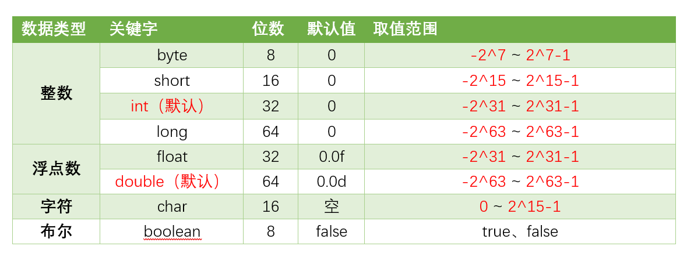
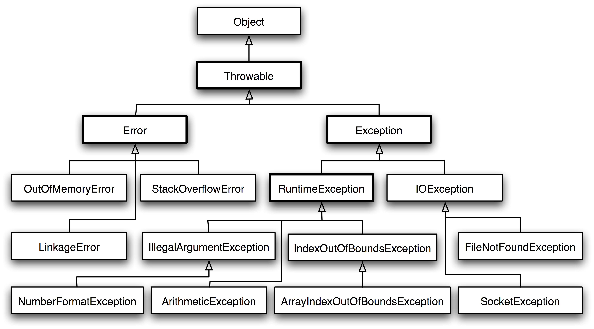

# Java基础

## 基础概念
Java的创建目的是为了让计算机能够像人一样思考，因此Java中所有的组成部分都必须符合人类的思维逻辑。
> 面向对象
Java的核心是面向对象OOP，Java中所有的组成部分都必须符合人类的思维逻辑。
> 跨平台
Java的跨平台是通过Java虚拟机实现的，Java虚拟机是一个软件，它可以运行Java程序。Java虚拟机可以运行在任何操作系统上，只要操作系统上安装了Java虚拟机就可以运行Java程序。
> 自动内存管理
Java中的内存管理是自动的，程序员不需要关心内存的分配和释放，Java虚拟机会自动管理内存。

### JVM，JDK，JRE的关系
JVM（Java Virtual Machine）是Java虚拟机，JVM是一个软件，它可以运行Java程序。JVM是Java程序和操作系统之间的桥梁，Java程序通过JVM和操作系统进行交互。
JDK（Java Development Kit）是Java开发工具包，JDK是Java程序的开发工具，JDK包含了Java编译器、Java虚拟机、Java文档、Java调试器等工具。
JRE（Java Runtime Environment）是Java运行环境，JRE是Java程序的运行环境，JRE包含了Java虚拟机、Java类库、Java运行时环境等。
三者的关系如下：
JDK = JRE + 开发工具
JRE = JVM + Java类库
JVM = Java虚拟机

### 为什么Java是半编译半解释型语言
Java是半编译半解释型语言，Java程序在运行时会先被编译成字节码文件，然后再由Java虚拟机解释执行字节码文件。Java是半编译半解释型语言的原因如下：
编译性质体现在字节码文件的生成上，Java程序在运行时会先被编译成字节码文件，然后再由Java虚拟机解释执行字节码文件。
解释性质体现在Java虚拟机的解释执行上，JVM中一个方法调用计数器，当一个方法被调用的次数达到一定的阈值时，JVM会将这个方法编译成本地代码，然后再执行本地代码。否则，JVM会使用解释器解释执行字节码文件。

### Java的基础数据类型

针对于特别精确的数据类型，Java提供了两种数据类型：
BigDecimal：用于精确计算，适用于货币计算等。
BigInteger：用于精确计算，适用于大数计算等。
需要注意的是，当使用BigDecimal和BigInteger进行计算时，需要使用BigDecimal和BigInteger提供的方法进行计算，不能使用+、-、*、/等运算符进行计算，同时在创建对象时，尽可能使用String类型的参数，避免使用double类型的参数以防精度丢失。

### 数据的拆装箱
#### 目的
数据的拆装箱是为了解决基本数据类型和包装类之间的转换问题，基本数据类型和包装类之间的转换是Java中常见的问题，数据的拆装箱可以方便的进行基本数据类型和包装类之间的转换。
将基本数据类型转换为包装类对象，这样做的优点是可以使用包装类对象的方法，例如：Integer.parseInt()、Integer.valueOf()等。
同时，在范型中，只能使用包装类对象，不能使用基本数据类型，因此在范型中需要将基本数据类型转换为包装类对象。
```java
List<Integer> list = new ArrayList<Integer>();
list.add(1);// 装箱
list.add(2);// 装箱
collection.sort(list);// 排序
```
如上，collection.sort()方法需要传入一个List<Integer>类型的参数，而list.add()方法需要传入一个Integer类型的参数，因此需要将基本数据类型转换为包装类对象。

集合中也不能存储基本数据类型，只能存储包装类对象，因此在集合中需要将基本数据类型转换为包装类对象。

#### 拆箱
拆箱是将包装类对象转换为基本数据类型，拆箱是通过包装类对象的xxxValue()方法实现的，例如：intValue()、longValue()、floatValue()、doubleValue()等。
```java
Integer integer = new Integer(1);// 装箱
Integer integer = 1;// 自动装箱
int i = integer.intValue();// 拆箱
int i = integer;// 自动拆箱
```
#### 装箱
装箱是将基本数据类型转换为包装类对象，装箱是通过包装类的valueOf()方法实现的，例如：Integer.valueOf()、Long.valueOf()、Float.valueOf()、Double.valueOf()等。
```java
int i = 1;// 基本数据类型
Integer integer = Integer.valueOf(i);// 装箱
```

拆箱与装箱的设置实质上涉及到Java中的引用类和基本类。
对于基本数据类型来说，其存储效率以及读写效率远高于引用类型，而引用类型的在泛化和集合中的使用更加方便，因此在Java中引入了拆装箱的机制，以便于在基本数据类型和引用类型之间进行转换，这是一种方便的机制。

同时，Java对于一些类设置了缓存池，例如：Integer、Long、Double等，这些类在创建对象时会使用缓存区，当创建对象时，如果缓存区中有该对象，则直接返回缓存区中的对象，否则创建一个新的对象。
例如：
```java
Integer integer1 = 1;
Integer integer2 = 1;
Integer integer3 = new Integer(1);
System.out.println(integer1 == integer2);// true
System.out.println(integer1 == integer3);// false
```
在上述代码中，integer1，2是缓存池中的对象，integer2是新创建的对象，因此integer1和integer3不是同一个对象，而integer1和integer2是同一个对象。

### Java的面向对象
面向对象是Java的核心，Java的面向对象是通过类和对象实现的，类是对象的模板，对象是类的实例。

#### 类和对象
class是Object的模板，Object是class的实例。
编写一个类的步骤如下：
1. 定义类
2. 定义属性
3. 定义方法
4. 创建对象
5. 调用方法
```java
// 定义一个类
public class Person {
    // 定义属性
    String name;
    int age;
    // 定义方法
    public void sayHello() {
        System.out.println("Hello, I am " + name + ", I am " + age + " years old.");
    }
}
// 创建对象
Person person = new Person();
// 调用方法
person.name = "Tom";
person.age = 18;
person.sayHello();
```

Java面向对象的3大特性为：封装、继承、多态。

#### 封装
封装（Encapsulation）是将对象的属性和方法封装在一起，对外部隐藏对象的属性和方法，只提供公共的方法供外部访问。
封装的优点在于，可以隐藏对象的属性和方法，提高了代码的安全性和可维护性。
```java
// 定义一个类
public class Person {
    // 定义属性
    private String name;
    private int age;
    // 定义方法
    public void setName(String name) {
        this.name = name;
    }
    public String getName() {
        return name;
    }
    public void setAge(int age) {
        this.age = age;
    }
    public int getAge() {
        return age;
    }
}
// 创建对象
Person person = new Person();
// 调用方法
person.setName("Tom");
person.setAge(18);
System.out.println(person.getName());
System.out.println(person.getAge());
```
使用这样子的方法，我们隐藏了person对象的属性，只提供了公共的方法供外部访问。

#### 继承
继承（Inheritance）是指一个类可以继承另一个类的属性和方法，子类可以继承父类的属性和方法，子类可以重写父类的方法。
```java
// 定义一个父类
public class Animal {
    // 定义属性
    String name;
    int age;
    // 定义方法
    public void eat() {
        System.out.println("I am eating.");
    }
}
// 定义一个子类
public class Dog extends Animal { //这里的语法，extends表示继承
    // 定义属性
    String breed;
    // 定义方法
    public void bark() {
        System.out.println("I am barking.");
    }
}
// 创建对象
Dog dog = new Dog();
// 调用方法
dog.name = "Tom";//这些属性是从父类继承过来的
dog.age = 18;
dog.breed = "Golden Retriever";
dog.eat();
dog.bark();
```
在上面的代码中，Dog类继承了Animal类的属性和方法，Dog类可以使用Animal类的属性和方法，同时Dog类可以重写Animal类的方法。

super关键字：
super关键字是指父类的引用，可以通过super关键字调用父类的属性和方法。
```java
// 定义一个父类
public class Animal {
    // 定义属性
    String name;
    int age;
    // 定义方法
    public void eat() {
        System.out.println("I am eating.");
    }
}
// 定义一个子类
public class Dog extends Animal {
    // 定义属性
    String breed;
    // 定义方法
    public void eat() {
        super.eat();// 调用父类的方法
        System.out.println("The dog is eating.");
    }
}
// 创建对象
Dog dog = new Dog();
// 调用方法
dog.eat(); // I am eating. The dog is eating.
```
在上面的代码中，super关键字用于调用父类的方法，super关键字可以调用父类的构造方法，super关键字可以调用父类的属性，super关键字可以调用父类的方法。

#### 多态
多态（Polymorphism）是指一个对象可以具有多种形态，一个对象可以是多种类型的。
多态的实现方式有两种：继承和接口。
```java
// 定义一个接口
public interface Animal {
    // 定义方法
    void eat();
    // 定义一个可选的方法
    void eat(String food);
    // 定义一个重载的方法
    void eat(String food, int count){
        System.out.println("The animal is eating " + count + " " + food);
    }

}
// 定义一个类
public class Dog implements Animal {
    // 定义方法,这是一种方法的重写
    public void eat() {
        System.out.println("I am eating.and I am a dog.");
    }
    // 定义方法
    public void eat(String food) {
        System.out.println("The dog is eating " + food);
    }
}
// 定义一个类
public class Cat implements Animal {
    // 定义方法
    public void eat() {
        System.out.println("I am eating.and I am a cat.");
    }
    // 定义方法
    public void eat(String food) {
        System.out.println("The cat is eating " + food);
    }
}
// 创建对象
Animal animal = new Dog();
// 调用方法
animal.eat();
animal.eat("meat");
animal = new Cat();
animal.eat();
animal.eat("fish");
```
在上面的代码中，Animal接口定义了一个eat()方法，Dog类和Cat类实现了Animal接口，Dog类和Cat类都有eat()方法，因此Animal接口可以引用Dog类和Cat类的对象，实现了多态。


#### 面向对象六大原则
1. 单一职责原则（Single Responsibility Principle）：一个类只负责一个功能。
2. 开闭原则（Open Closed Principle）：一个类应该对扩展开放，对修改关闭。
3. 里氏替换原则（Liskov Substitution Principle）：子类可以替换父类。
4. 依赖倒置原则（Dependency Inversion Principle）：高层模块不应该依赖底层模块，两者都应该依赖抽象。
5. 接口隔离原则（Interface Segregation Principle）：使用多个专门的接口，而不使用单一的总接口。
6. 迪米特法则（Law of Demeter）：一个对象应该对其他对象有最少的了解。

#### 抽象类和接口
抽象类是一种特殊的类，抽象类不能被实例化，抽象类中可以包含抽象方法和非抽象方法，抽象方法没有方法体，只有方法的声明，抽象类中的抽象方法必须在子类中实现。
```java
// 定义一个抽象类
public abstract class Animal {
    // 定义抽象方法
    public abstract void eat();
    // 定义非抽象方法
    public void sleep() {
        System.out.println("I am sleeping.");
    }
}
// 定义一个子类
public class Dog extends Animal {
    // 实现抽象方法
    public void eat() {
        System.out.println("I am eating.");
    }
}
// 创建对象
Animal animal = new Dog();
// 调用方法
animal.eat();
animal.sleep();
```
接口是一种特殊的抽象类，接口中只能包含抽象方法和常量，接口中的方法必须在子类中实现。
```java
// 定义一个接口
public interface Animal {
    // 定义常量
    int age = 18;
    // 定义抽象方法
    void eat();
    // 定义默认方法
    default void sleep() {
        System.out.println("I am sleeping.");
    }
}
// 定义一个类
public class Dog implements Animal {
    // 实现抽象方法
    public void eat() {
        System.out.println("I am eating.");
    }
}
public class Cat implements Animal {
    // 实现抽象方法
    public void eat() {
        System.out.println("I am eating.");
    }
}
// 创建对象
Animal animal = new Dog();
// 调用方法
animal.eat();
animal.sleep();
```
抽象类和接口的区别如下：
1. 抽象类可以有构造方法，接口不能有构造方法。
2. 抽象类中可以包含抽象方法和非抽象方法，接口中只能包含抽象方法和常量。
3. 一个类只能继承一个抽象类，一个类可以实现多个接口:
```java
// 定义一个接口
public interface Animal {
    // 定义常量
    int age = 18;
    // 定义抽象方法
    void eat();
    // 定义默认方法
    default void sleep() {
        System.out.println("I am sleeping.");
    }
    // 定义静态方法
    static void run() {
        System.out.println("I am running.");
    }
    // 定义私有方法，该方法只能在接口中使用
    private void run() {
        System.out.println("I am running.");
    }
}
// 定义一个接口
public interface Dog {
    // 定义抽象方法
    void eat();
}
// 定义一个类，实现多个接口
public class Dog implements Animal, Dog {
    // 实现抽象方法
    public void eat() {
        System.out.println("I am eating.");
    }
}
```

#### 类的静态成员
静态成员是指类的成员，静态成员属于类，不属于对象，静态成员可以通过类名直接访问，静态成员只有一份，所有对象共享。
```java
// 定义一个类
public class Person {
    // 定义静态属性
    static String name;
    static int num = 0;
    Person() {
        num++;
    }
    // 定义静态方法
    static void sayHello() {
        System.out.println("Hello, I am " + name + ".");
    }
}
// 访问静态成员
Person.name = "Tom";
Person.sayHello();
Person.num = 1;
Person person1 = new Person();
Person person2 = new Person();
System.out.println(Person.num);// 
```
静态变量和方法之间能够相互访问，静态变量和方法之间不能访问非静态变量和方法，非静态变量和方法之间能够相互访问。
在使用上，设置静态的原因是：
变量：静态变量是所有对象共享的，可以通过类名直接访问，适用于所有对象共享的属性，例如：计数器。
方法：静态方法是所有对象共享的，可以通过类名直接访问，用于获取类级别的数据，适用于所有对象共享的方法，例如：工具类。

同时，在一个实例被创建时，静态模块会先被初始化，然后再初始化实例。

如果是子类继承父类，将会首先执行父类的静态模块，然后执行子类的静态模块，然后再是父类的实例模块，最后是子类的实例模块。


### 重要数据结构，String
String是一个引用类型，且设置了final关键字，因此String是不可变的，String对象一旦创建，就不能被修改，如果需要修改String对象，需要重新创建一个新的String对象。
```java
String str = "Hello";
str = str + " World";
```
在上面的代码中，str是一个String对象，str + " World"是一个新的String对象，str指向了新的String对象，原来的String对象没有被修改。


```markdown
有关于final关键词：
设置类：
public final class Person {
    // 方法体
    public final void sayHello() {
        System.out.println("Hello, I am Tom.");
    }
}
设置变量：
public final int num = 1;
final关键字的作用：
1. final修饰的类不能被继承。
2. final修饰的方法不能被重写。
3. final修饰的变量不能被修改。
4. final修饰的变量必须初始化。
5. final修饰的变量可以是静态变量。

```

不可变的好处：
1. 线程安全：String是不可变的，多个线程可以同时访问一个String对象，不会出现线程安全问题。
2. 缓存：String是不可变的，String对象可以被缓存，缓存可以提高程序的性能。
3. 可缓存的hash值：String是不可变的，String对象的hash值可以被缓存，提高了hashMap的性能。
4. 作为参数：String是不可变的，String对象可以作为参数传递，不会被修改。

#### String的常用方法
1. charAt()：获取指定位置的字符。
```java
String str = "Hello";
char ch = str.charAt(0);
System.out.println(ch);// H
```
2. length()：获取字符串的长度。
```java
String str = "Hello";
int len = str.length();
System.out.println(len);// 5
```
3. substring()：截取字符串。
```java
String str = "Hello";
String subStr = str.substring(1, 3);// 1表示开始位置，3表示结束位置，不包括结束位置
System.out.println(subStr);// el
```
4. indexOf()：获取指定字符的索引。
```java
String str = "Hello";
int index = str.indexOf("l");
System.out.println(index);// 2
```
5. contains()：判断字符串是否包含指定字符。
```java
String str = "Hello";
boolean flag = str.contains("l");
System.out.println(flag);// true
```
6. equals()：判断字符串是否相等。
```java
String str1 = "Hello";
String str2 = "Hello";
boolean flag = str1.equals(str2);
System.out.println(flag);// true
String str3 = new String("Hello");
flag = str1.equals(str3);
System.out.println(flag);// true
String.out.println(str1 == str3);// false ,因为str3是新创建的对象，str1和str3指向的是不同的对象
```

### 对象通用方法
#### equals()方法
equals()方法是Object类的方法，用于判断两个对象是否相等，equals()方法的默认实现是比较两个对象的引用是否相等，即比较两个对象的地址是否相等。
```java
String str1 = "Hello";
String str2 = "Hello";
boolean flag = str1.equals(str2);
System.out.println(flag);// true
String str3 = new String("Hello");
flag = str1.equals(str3);
System.out.println(flag);// true
String.out.println(str1 == str3);
```
在上面的代码中，str1和str2是相等的，因为它们指向的是同一个对象，str1和str3是相等的，因为它们的值相等，但是str1和str3指向的是不同的对象。
对于引用类型，== 判断两个变量是否引用同一个对象，而 equals() 判断引用的对象是否等价。

#### toString()方法
toString()方法是Object类的方法，用于返回对象的字符串表示，toString()方法的默认实现是返回对象的类名和对象的哈希码。
```java
Public class Person {
    String name;
    int age;
    public String toString() {
        return "Person[name=" + name + ", age=" + age + "]";
    }
}
Person person = new Person();
person.name = "Tom";
person.age = 18;
String str = person.toString();
System.out.println(str);// Person[name=Tom, age=18]@1a2b3c4d  后面的是哈希码
```
在上面的代码中，str是一个String对象，str.toString()返回的是str对象的值。

#### hashCode()方法
hashCode()方法是Object类的方法，用于返回对象的哈希码，哈希码是一个int类型的数值，用于表示对象的地址。
等价的对象，hashCode()方法返回的哈希码是相等的，但是哈希码相等的对象不一定是等价的，这是因为计算哈希值具有随机性，两个值不同的对象可能计算出相同的哈希值。
```java
String str = "Hello";
int hashCode = str.hashCode();
System.out.println(hashCode);// 69609650

String str1 = "Hello";
Hashset<String> set = new HashSet<>();
set.add(str);
set.add(str1);
System.out.println(set.size());// 1
String str2 = new String("Hello");
set.add(str2);
System.out.println(set.size());// 2
```

#### clone()方法
这里涉及到深拷贝和浅拷贝的问题。
浅拷贝：
浅拷贝是指拷贝对象时，只拷贝对象的引用，不拷贝对象的属性，拷贝对象和原对象的属性指向同一个地址。
深拷贝：
深拷贝是指拷贝对象时，不仅拷贝对象的引用，还拷贝对象的属性，拷贝对象和原对象的属性指向不同的地址，也就是说拷贝对象和原对象是两个独立的对象。

在Java中，clone()方法是Object类的方法，用于创建对象的副本，clone()方法的默认实现是浅拷贝，即拷贝对象和原对象的属性指向同一个地址。
```java
Person person = new Person();
person.name = "Tom";
person.age = 18;
Person person1 = (Person) person.clone(); // 浅拷贝
System.out.println(person == person1);// false
System.out.println(person.name == person1.name);// true
```
```java
public class Person implements Cloneable {
    String name;
    int age;
    public Object clone() {
        try {
            return super.clone();
        } catch (CloneNotSupportedException e) {
            e.printStackTrace();
            return null;
        }
    }
}
Person person = new Person();
person.name = "Tom";
person.age = 18;
Person person1 = (Person) person.clone(); // 深拷贝
System.out.println(person == person1);// false
System.out.println(person.name == person1.name);// true
```

使用clone()方法时，需要实现Cloneable接口，否则会抛出CloneNotSupportedException异常。

由于clone()较为复杂和耗时，因此在实际使用中可以使用拷贝构造函数或者拷贝工厂来拷贝一个对象。
```java
public class Person {
    String name;
    int age;
    public Person(Person person) {
        this.name = person.name;
        this.age = person.age;
    }
}
Person person = new Person();
person.name = "Tom";
person.age = 18;
Person person1 = new Person(person); // 拷贝构造函数
System.out.println(person == person1);// false
System.out.println(person.equals(person1));// true
```
在实际场景中，为应对不同的需求，我们可以使用序列化和反序列化来实现深拷贝。
```java
public class Person implements Serializable {
    String name;
    int age;
    public void sayHello() {
        System.out.println("Hello, I am " + name + ", I am " + age + " years old.");
    }
}
public class Test {
    public static void main(String[] args) {
        Person person = new Person();
        person.name = "Tom";
        person.age = 18;
        Person person1 = (Person) deepClone(person); // 深拷贝
        System.out.println(person == person1);// false
        System.out.println(person.equals(person1));// true
    }
    public static Object deepClone(Object obj) {
        try {
            ByteArrayOutputStream bos = new ByteArrayOutputStream();
            ObjectOutputStream oos = new ObjectOutputStream(bos);
            oos.writeObject(obj);
            ByteArrayInputStream bis = new ByteArrayInputStream(bos.toByteArray());
            ObjectInputStream ois = new ObjectInputStream(bis);
            return ois.readObject();
        } catch (Exception e) {
            e.printStackTrace();
            return null;
        }
    }
}
```


### 细节小点
#### 反射
反射是Java的一个重要特性，反射是指在运行时动态获取类的信息，反射可以获取类的属性、方法、构造方法等信息，反射可以动态创建对象、调用方法、获取属性等。
其重点在于运行时动态获取类的信息。
反射的主要用途在于框架的设计，例如：Spring、Mybatis等框架都是基于反射实现的，为了保证框架的通用性，它们可能需要根据配置文件加载不同的对象或类
```java
public class Person {
    String name;
    int age;
    public void sayHello() {
        System.out.println("Hello, I am " + name + ", I am " + age + " years old.");
    }
}
public class Test {
    public static void main(String[] args) {
        Class clazz = Person.class;
        Field[] fields = clazz.getDeclaredFields();
        for (Field field : fields) {
            System.out.println(field.getName());
        }
        Method[] methods = clazz.getDeclaredMethods();
        for (Method method : methods) {
            System.out.println(method.getName());
        }
        Constructor[] constructors = clazz.getDeclaredConstructors();
        for (Constructor constructor : constructors) {
            System.out.println(constructor.getName());
        }
    }
}
```

#### 异常

Throwable是Java中所有异常的父类，Throwable有两个子类：Error和Exception。
Error是指系统级别的错误，例如：内存溢出、栈溢出等，Error是无法处理的，只能让程序终止。
Exception是指程序级别的错误，例如：空指针、数组越界等，Exception是可以处理的，需要程序员进行处理。
Exception又分为两种：
> 受检异常: 受检异常是指在编译时就能检测到的异常，受检异常是需要程序员进行处理的，如果不处理受检异常，程序就无法编译通过。
```java
try {
    // 可能会抛出受检异常的代码
} catch (Exception e) {
    // 处理受检异常
}
```
> 非受检异常: 非受检异常是指在编译时无法检测到的异常，非受检异常是不需要程序员进行处理的，如果不处理非受检异常，程序就无法编译通过,例如除以0。

#### Java和C++的区别
Java和C++是两种不同的编程语言，Java是一种面向对象的编程语言，C++是一种面向对象的编程语言，Java和C++的区别如下：
1. Java是一种半编译半解释型语言，C++是一种编译型语言。
2. Java是一种跨平台语言，C++依赖于操作系统。
3. Java是一种自动内存管理语言，C++需要程序员手动管理内存，即自动内存回收。
4. Java不支持多重继承，C++支持多重继承，Java通过接口实现多重继承。
5. Java中没有指针，C++中有指针，Java中的引用类似于C++中的指针，但是Java中的引用是安全的，不会出现指针越界等问题。
6. Java中没有运算符重载，C++支持运算符重载。