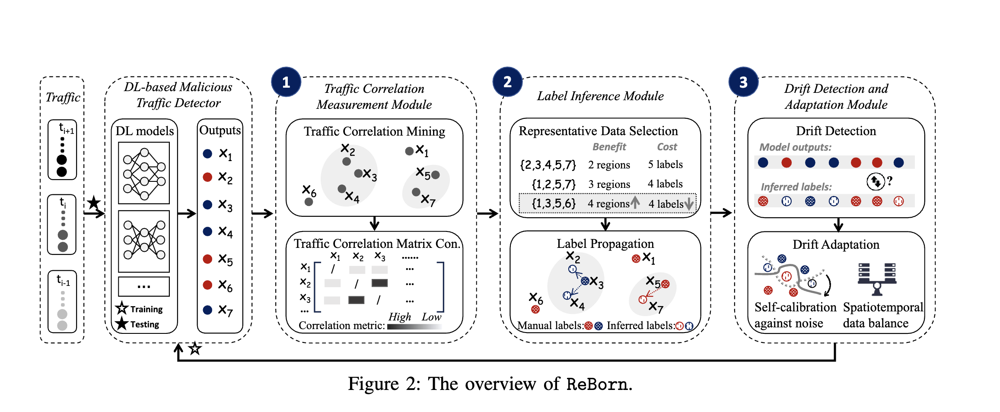

1. **Covert Drift 的定义：**
   文章中提到的 "covert drift"（隐蔽漂移）是指在网络流量中存在的一种特殊形式的概念漂移（concept drift）。在这种情况下，流量的某些样本在特征上与训练数据相似，但是它们的实际标签（ground-truth labels）与训练数据相反。这意味着即使测试数据的特征分布（即边缘分布，marginal distribution P(X)）没有发生变化，条件分布（即P(y|X)，表示给定特征X时标签y的概率）却发生了变化。隐蔽漂移难以被传统的基于特征分布变化的方法检测到，因为它涉及到标签维度的变化，而不是特征本身的分布变化。

2. **工作流程的基本了解：**
   文章提出的 ReBorn 框架旨在高效地检测和不断学习隐蔽漂移的流量，其工作流程主要包括以下几个步骤：

   - **流量相关性测量模块（Traffic Correlation Measurement Module）：** 使用集成聚类方法来准确评估高维测试流量数据之间的相关性。
   
   - **标签推断模块（Label Inference Module）：** 设计了一个多目标优化函数，选择一小部分代表性测试流量数据进行手动标注，并基于测量得到的流量相关性推断其余测试数据的标签。
   
   - **漂移检测与适应模块（Drift Detection and Adaptation Module）：** 通过比较 ReBorn 推断的测试数据标签和模型预测结果来检测条件分布的偏移，并开发了一种新颖的增量训练损失函数，以在标签噪声和时空数据不平衡的情况下，使深度学习模型学习新的测试数据分布。

# Note of "Robust Malicious Traffic Detection under Covert Drifting Traffic"

## Abstract
该实验提出一种主动学习框架ReBorn，用于实现高效检测以及实时标注隐蔽漂移的网络流量。
该框架可以很好的适应标签噪声和时空数据不平衡的情况，同时还能够在不断学习新的测试数据分布的情况下，保持模型的准确性。
需要完成的工作为：
确定covert drift的定义，以及ReBorn框架的工作流程。
针对covert drift的检测提出其具体应用场景，并确定其实际应用必要性。

## Background and porblem statement
网络流量中的隐蔽漂移是指流量的某些样本在特征上与训练数据相似，但是它们的实际标签与训练数据相反。

## The structure of ReBorn
1. The traffic correlation measurement module accurately measures the degrees of correlations between het- erogeneous and high-dimensional testing traffic samples via an ensemble clustering based algorithm. 
2. Next, the label infer- ence module introduces a novel multi-objective optimization function that comprehensively balances the distribution-aware gains of choosing specific testing samples (i.e., whether the selected samples can cover the whole distribution of the testing data) and the manual labeling costs.
3. Finally, with the (ReBorn-inferred) labels of testing samples, the drift detection and adaptation module detects drift by checking the conditional distribution shifts and introduces a novel incremental training loss function to make the DL-based detector learn the new distribution of testing data while reducing the negative impacts of label noises and spatiotemporal data imbalance.

总结如下：
1. 流量相关性测量模块：使用集成聚类方法来准确评估高维测试流量数据之间的相关性。
2. 标签推断模块：设计了一个多目标优化函数，选择一小部分代表性测试流量数据进行手动标注，并基于测量得到的流量相关性推断其余测试数据的标签。
3. 漂移检测与适应模块：通过比较 ReBorn 推断的测试数据标签和模型预测结果来检测条件分布的偏移，并开发了一种新颖的增量训练损失函数，以在标签噪声和时空数据不平衡的情况下，使深度学习模型学习新的测试数据分布。

具体分析如下：
1. 流量相关性测量模块：通过集成聚类方法来准确评估高维测试流量数据之间的相关性。这一步的目的是为了找到一些代表性的测试流量数据，以便在后续的标签推断模块中进行手动标注。

2. 标签推断模块：设计了一个多目标优化函数，选择一小部分代表性测试流量数据进行手动标注，并基于测量得到的流量相关性推断其余测试数据的标签。这一步的目的是为了推断测试数据的标签，以便在后续的漂移检测与适应模块中检测条件分布的偏移。
概念：
标签传播算法（Label Propagation Algorithm）：是一种半监督学习算法，用于将已知标签的数据传播到未知标签的数据。在本文中，标签传播算法用于推断测试数据的标签。
步骤：
A. Representative Sample Selection ：选择一小部分代表性的测试流量数据进行手动标注。
B. Label propagation ：基于测量得到的流量相关性，推断其余测试数据的标签。

3. 漂移检测与适应模块：通过比较 ReBorn 推断的测试数据标签和模型预测结果来检测条件分布的偏移，并开发了一种新颖的增量训练损失函数，以在标签噪声和时空数据不平衡的情况下，使深度学习模型学习新的测试数据分布。这一步的目的是为了检测条件分布的偏移，并使深度学习模型学习新的测试数据分布。

概念：
增量训练（Incremental Training）：是一种训练方法，用于在训练数据不断增加的情况下，更新模型的参数。在本文中，增量训练用于使深度学习模型学习新的测试数据分布。
步骤：
A. Drift Detection ：通过比较 ReBorn 推断的测试数据标签和模型预测结果来检测条件分布的偏移。

B. Drift Adaptation ：开发了一种新颖的增量训练损失函数，以在标签噪声和时空数据不平衡的情况下，使深度学习模型学习新的测试数据分布。

C. Application and unsupervised DL Models ：将 ReBorn 框架应用于无监督深度学习模型，以检测隐蔽漂移的网络流量。
公式分析：
1. **条件分布偏移检测** \( \Delta \)：
   \[
   \Delta = \frac{1}{|D_{\text{test}}|} \sum_{i=0}^{|D_{\text{test}}|-1} u_i(\hat{y}_i \oplus f(X_i))
   \]
   - 这个方程通过计算测试数据集 \( D_{\text{test}} \) 中每个样本的预测标签 \( f(X_i) \) 和推断标签 \( \hat{y}_i \) 之间的不一致性来检测概念漂移。
   - 原因：如果 \( f(X_i) \) 和 \( \hat{y}_i \) 一致，则 \( \oplus \) 操作结果为0，对 \( \Delta \) 贡献小；如果不一致，则 \( \oplus \) 操作结果为1，乘以不确定性因子 \( u_i \) 后对 \( \Delta \) 贡献大。当 \( \Delta \) 超过阈值时，表明模型预测与实际标签有显著差异，提示概念漂移。

2. **熵的计算** \( H(f(X)) \)：
   \[
   H(f(X)) = -p_0(X) \log p_0(X) + p_1(X) \log p_1(X)
   \]
   - 熵是信息论中的一个概念，用来衡量随机变量的不确定性。
   - 原因：在分类问题中，如果模型对某个样本的预测非常不确定（即 \( p_0 \) 和 \( p_1 \) 接近），则熵值会很高。通过最小化熵，可以鼓励模型产生更确定的预测，减少标签噪声的影响。

3. **自适应权重** \( \omega_t \) 和 \( \omega_s \)：
   - \( \omega_t \) 根据时间窗口调整权重，使得最近的数据有更高的权重。
   - \( \omega_s \) 根据类别比例调整权重，使得类别比例不平衡的问题得到缓解。
   - 原因：在动态网络环境中，新数据往往更能代表当前的概念分布，而类别比例的不平衡会影响模型学习。自适应权重确保模型可以适应这些变化。

4. **增量训练损失函数** \( L(D) \)：
   \[
   L(D) = \sum_{(X,y) \in D} (\omega_t \cdot \omega_s \cdot \ell(X, y) + \lambda_4 H(f(X)))
   \]
   - 结合了原始损失 \( \ell(X, y) \) 和熵项 \( H(f(X)) \)，并通过自适应权重 \( \omega_t \) 和 \( \omega_s \) 进行调整。
   - 原因：这样的组合允许模型在增量学习过程中，同时考虑预测准确性和不确定性，并通过自适应权重来处理数据的时间敏感性和类别不平衡。

5. **无监督DL模型的损失函数** \( \ell' \)：
   \[
   \ell' = \text{ReLU}(B - y \ell_\phi(X) + (1 - y) \ell_\phi(X))
   \]
   - 引入ReLU函数和权重 \( y \) 和 \( 1-y \) 来调整正常和恶意样本的损失。
   - 原因：对于无监督学习，没有真实标签 \( y \)，但可以通过这种方式鼓励模型区分正常和恶意流量。ReLU函数确保损失不会是负值，从而避免不适当的梯度更新。

6. **无监督模型的增量训练损失函数** \( L'(D) \)：
   \[
   L'(D) = \sum (\omega_t \cdot \omega_s \cdot \ell'(X, y) + \lambda_4 H(f'(X)))
   \]
   - 与监督模型类似，但使用了无监督损失 \( \ell' \)。
   - 原因：这个损失函数允许无监督模型在增量学习中，通过自适应权重和熵项来适应新数据分布，同时最小化由于数据不平衡或噪声带来的负面影响。

## Experiments