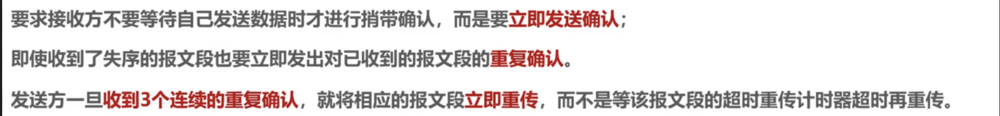
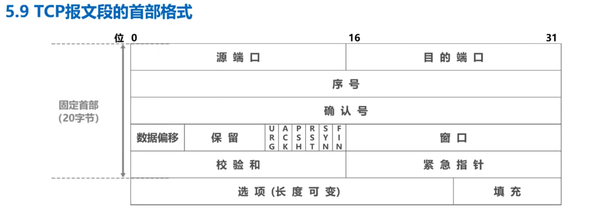

# 计算机网络学习笔记

教材：计算机网络（自顶向下方法）第七版
课程视频：[中科大计算机网络公开课](https://www.bilibili.com/video/BV1JV411t7ow?p=2&vd_source=e0c5d304125ac648272a937672080091)

## 1. 计算机网络概述
### 书本预习内容
- 计算机网络的定义
计算机网络是互连的、自治的计算机集合。
因特网是一个全球的计算机网络，是由互联网服务提供商（ISP）和其他组织共同构成的。
- 端系统通过通信链路和分组交换机连接到因特网。
通信链路（communication link）：不同的物理媒介，如同轴电缆、铜线、光纤等。
分组交换机（packet switch）：将数据分组从一个端系统移动到另一个端系统。
端系统通过因特网服务提供商（ISP）接入因特网。
- 所有的通信和传输都需要遵守协议。
协议定义了在两个或多个通信实体之间交换的报文格式和顺序，以及报文发送和接收一条报文或其他事件所采取的动作。
TCP（Transmission Control Protocol）和IP（Internet Protocol）是因特网的两个核心协议。
零碎知识点：
分布式应用程序：运行在不同端系统上的应用程序。
套接字接口：应用程序通过套接字接口调用协议来发送和接收报文。该接口规定了运行
在一个端系统上的程序请求因特网基础设施向运行在另一个端系统上的特定目的地程序交
付数据的方式。
- 网络边缘
网络边缘是指连接到因特网的端系统。
端系统又称为主机（host），包括台式机、笔记本电脑、手机、Web 服务器、Web 客户端
又分为客户端和服务器。

- 接入网络
接入网络是端系统连接到其边缘路由器的物理链路。
1. 家庭接入：DSL、电缆、FTTH、拨号调制解调器、卫星
DSL：数字用户线（Digital Subscriber Line）是一种家庭接入技术，它使用现有的电话线来传输数字信号。
电缆因特网接入：通过有线电视公司提供的电缆来接入因特网。
FTTH：光纤到户（Fiber To The Home）是一种家庭接入技术，它使用光纤来传输数字信号。
拨号调制解调器：通过电话线接入因特网。
卫星因特网接入：通过卫星接入因特网。
2. 企业接入：以太网、WiFi
使用局域网（Local Area Network）技术，如以太网和 WiFi。
以太网：一种局域网技术，使用双绞线或光纤来传输数据，需要有线交换机。
WiFi：一种无线局域网技术，使用无线接入点（wireless access point）来传输数据。
3. 移动接入：3G、4G、5G
广域无线接入技术，通过蜂窝网络连接到因特网。

- 物理媒介
1. 双绞线：一种传输数据的物理媒介，由四对绝缘的铜线组成。
2. 同轴电缆：一种传输数据的物理媒介，由一对中心导体、绝缘层、外导体和外部绝缘层组成。
3. 光纤：一种传输数据的物理媒介，由一根玻璃纤维组成，可以传输光信号。
4. 无线电频谱：一种传输数据的物理媒介，通过无线电波传输数据。分为陆地无线电频谱和卫星无线电频谱。
   
- 网络核心

## TCP相关
为了完成某项目（）需要了解TCP相关知识，这里记录一些TCP相关的知识点。
大致需要的知识点如下：
tcp流量
tcp层的协议

异常情况了解

包头

负载

记录日志数据

tcp包会丢包

需要重新传

序列号

按照序列号组织

但是有网络硬塞抖动出现重新传

可能有乱序/序列号覆盖

wireshark

通讯软件

看包

组装

学习路线如下：
1. 了解TCP协议：视频学习：[TCP协议详解](https://www.bilibili.com/video/BV1c4411d7jb?p=60&spm_id_from=pageDriver&vd_source=e0c5d304125ac648272a937672080091）
2. 了解异常情况：
3. 了解包头
4. 了解负载
5. 学习wireShark的使用

### TCP的流量控制
TCP的流量控制是通过滑动窗口实现的。
目的是为了防止发送方发送速度过快，导致接收方无法处理。
接收方通过ACK进行通知，发送方根据ACK的信息调整发送速度以及滑动窗口的大小。

具体的流程如下：
1. 发送方发送数据包，接收方接收数据包，发送ACK。
2. 发送方根据ACK的信息调整发送速度，以及滑动窗口的大小。
3. 发送方根据接收方的滑动窗口大小，发送数据包。
4. 接收方接收数据包，发送ACK。

可能的异常情况：
1. 传输丢包：发送方发送数据包，接收方未收到数据包，发送方未收到ACK。
解决方法：
    1. 重传数据包：发送方未收到ACK，重传数据包。
    2. 接收方未收到数据包，发送方未收到ACK，接收方重发ACK。

2. 接受缓存在流控设置为0后又有空间了，发送方如何知道？
解决方法：
    1.设置计时器，当接收方的滑动窗口大小为0时，发送方设置计时器，当计时器超时后，发送0窗口探测报文，接收方收到0窗口探测报文后，发送ACK，发送方根据ACK的信息调整发送速度以及滑动窗口的大小。
对于0窗口探测报文也需要设置计时器以防其丢失

### TCP的拥塞控制
TCP的拥塞控制是通过拥塞窗口实现的。
在某段时间，若对网络中某一资源的需求超过了该资源所能提供的处理能力，网络的性能就会下降，这种现象称为网络拥塞。

四种算法：
1. 慢开始：

2. 拥塞避免
3. 快重传
4. 快恢复

总体思路：
设置cwnd和ssthresh两个参数，cwnd表示拥塞窗口的大小，ssthresh表示慢开始阈值。
只要网络没有出现拥塞，cwnd就会随着时间的推移而增大，直到达到ssthresh。
出现拥塞的依据：发送方未收到ACK，发送方重传数据包，接收方未收到数据包，发送方未收到ACK，接收方重发ACK。（超时重传

swnd：发送窗口大小 = min（cwnd，rwnd）
当cwnd < sshtresh时，使用慢开始算法，指数增长，cwnd每次double。
当cwnd >= sshtresh时，使用拥塞避免算法，线性增长，cwnd每次+1。
出现拥塞时，ssthresh = cwnd / 2，cwnd = 1。

当发生超时重传而无拥塞时，由于算法可能回较慢，因此引入快重传和快恢复
快重传是使发送方尽快进行重传而不是等超时重传计时器超时再重传

快恢复是指在发生超时重传时，将ssthresh设置为cwnd的一半，cwnd设置为ssthresh，然后进行拥塞避免算法。

### 超时重传
RTO：重传超时时间
RTTO：往返时间

加权平均往返时间：SRTT = (1 - a) * SRTT + a * RTT
a一般取0.125

RTO = RTT（s） + 4 * RTT（D）
RTT（D） = RTT1 / 2
RTTd = （1-b）* RTTd + b * |RTT1 - SRTT|
b = 0.25

出现超时重传时无法准确计算RTT，因此当重传了就不采用其往返时间计算，而是采用RTO；

然而若突然出现时延增大，由于上述算法，每一次都会重传

修正Karn算法：当出现超时重传时，不计算RTT，而是将RTO加倍

### 可靠传输的实现
使用指针描述发送窗口和接收窗口
发送窗口：发送方维护的窗口，用于存放已发送但未收到ACK的数据包

### TCP连接建立和释放
三次握手：
1. 客户端发送SYN报文，请求建立连接：SYN = 1，seq = x
2. 服务器收到SYN报文，发送SYN+ACK报文，确认连接：SYN = 1，ACK = 1，seq = y，ack = x + 1
3. 客户端收到SYN+ACK报文，发送ACK报文，确认连接：ACK = 1，seq = x + 1，ack = y + 1
4. 服务器收到ACK报文，连接建立成功
各个字符含义：
SYN：同步序号
ACK：确认序号
seq：序号
ack：确认号
SYN=1的报文段不能携带数据，但是会占用序号空间
普通的确认报文段如果不携带数据，不占用序号空间

四次挥手：
1. 客户端发送FIN报文，请求关闭连接：FIN = 1，ACK = 1，seq = x,ack = y：进入终止等待1状态
2. 服务器收到FIN报文，发送ACK报文，确认关闭连接：ACK = 1，seq = y，ack = x + 1:TCP普通确认，进入关闭等待状态，客户端收到后进入终止等待2状态，此时服务器仍然可以发送数据
3. 服务器发送FIN报文，请求关闭连接：FIN = 1，ACK = 1，seq = z，ack = x + 1：进入最后确认状态
4. 客户端收到FIN报文，发送ACK报文，确认关闭连接：ACK = 1，seq = x + 1，ack = z + 1：进入时间等待状态，等待2MSL后关闭连接

保活计时器：当连接空闲时，发送保活报文，若对方未响应，则关闭连接
由主机发起，每隔2小时发送一次，若对方未响应，则发送11次后关闭连接

### TCP报文的首部格式

1. 源端口号：16位，标识发送方端口号
2. 目的端口号：16位，标识接收方端口号
3. 序号：32位，标识数据段的第一个字节的序号
4. 确认号：32位，标识期望收到的下一个字节的序号，即n-1的都已接受
5. ACK：1位，标识确认号是否有效
6. 数据偏移：4位，标识首部长度，单位为4字节，最小为0101，即20字节
7. 保留：6位，保留字段
8. 窗口大小：16位，标识接收方窗口大小
9. 校验和：16位，校验首部和数据段
10. SYN：1位，同步序号
11. FIN：1位，结束标志，表明为终止标识位
12. RST：1位，复位连接，表明连接异常需要释放，重新连接，也可以哟还能缓过来拒绝一个非法的报文段或拒绝一个非法的连接
13. PSH：1位，推送标志，表明接收方应该尽快将数据交给应用层
14. URG：1位，紧急标志，表明紧急指针字段有效
15. 紧急指针：16位，紧急数据的末尾位置，紧急数据是指在正常数据传输之外的数据，如紧急报文

### TCP的各类异常情况
#### TCP的重传
1. 超时重传：发送方发送数据包，接收方未收到数据包，发送方未收到ACK。

2. 快速重传：接收方未收到数据包，发送方未收到ACK，接收方重发ACK。
具体机制：接收方未收到数据包，发送方未收到ACK，则接收方重发ACK，发送方收到三个重复的ACK，发送方立即重传数据包。

3. 乱序重传：接收方未按序接收数据包，发送方未收到ACK，接收方重发ACK。  
  
4. SACK：选择性确认，接收方可以选择性确认已接收的数据包。  
用处：可以减少重传的数据包，提高网络的效率。  
5. D-SACK：接收方确认接收到的数据包中有重复的数据包。  
好处：  
可以让「发送方」知道，是发出去的包丢了，还是接收方回应的 ACK 包丢了;
可以知道是不是「发送方」的数据包被网络延迟了;
可以知道网络中是不是把「发送方」的数据包给复制了;
