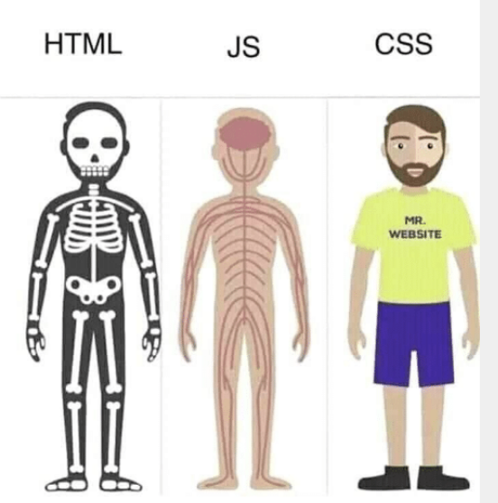
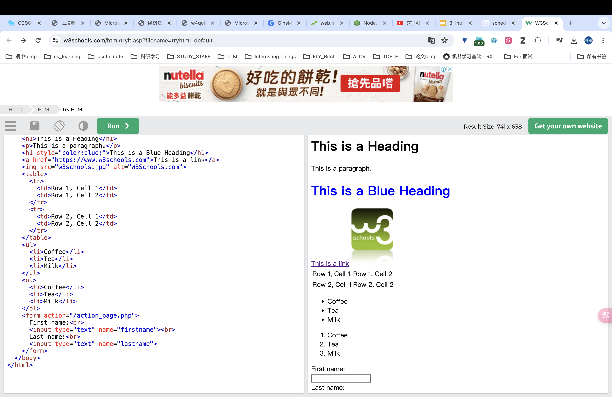

# WEBLAB

It is a note of my self-study on web development. I will be using this note to keep track of my progress and to keep a record of what I have learned.

学习链接：[WebLab](https://weblab.mit.edu/schedule/)

## HTML & CSS 初步认识学习
架构关系：HTMI 为网页的骨架，CSS 为网页的皮肤，JavaScript 为网页的肌肉（交互）。

### 1. HTML 
HTML ，全称为超文本标记语言（HyperText Markup Language），    
是一种标记语言，用于构建网页。HTML 由一系列元素组成，这些元素告诉浏览器如何显示页面的内容。HTML 元素由开始标签、结束标签、元素的内容和元素的属性组成。  

简单的 HTML 文档结构如下：
```html
<!DOCTYPE html>
<html>
  <head>
    <title>Page Title</title>
  </head>
  <body>
    <h1>This is a Heading</h1>
    <p>This is a paragraph.</p>
  </body>
</html>
```
点击此处打开 [HTML 实例](https://www.w3schools.com/html/tryit.asp?filename=tryhtml_default)
这个网站可以用于测试 HTML 代码。

进一步语法解释：
- `<!DOCTYPE html>` 声明为 HTML5 文档  
- `<html>` 元素是 HTML 页面的根元素  
- `<head>` 元素包含了文档的元（meta）数据  
- `<title>` 元素描述了文档的标题  
- `<body>` 元素之间的内容是可见的页面内容  
- `<h1>` 元素定义一个大标题  
- `<p>` 元素定义一个段落  
- HTML 标签是由尖括号包围的关键词，比如 `<html>`  
- HTML 标签通常是成对出现的，比如 `<b>` 和 `</b>`  
- 标签对中的第一个标签是开始标签，第二个标签是结束标签  

下面介绍几个常用的 HTML 标签：  
- `<h1>` 到 `<h6>` 定义 HTML 标题  
- `<br>` 插入一个换行符  
- '<tagname style="property:value;">' 可以用来设置元素的样式,如 `<h1 style="color:blue;">This is a Blue Heading</h1>`  
- `<a>` 定义超链接 : `<a href="url">link text</a>`  
- '' 定义图像 : ``  
- `<table>` 定义表格  
- `<ul>` 定义无序列表  
- `<ol>` 定义有序列表  
- `<li>` 定义列表项目  
- `<form>` 定义表单  <br>
- '<div>' 定义文档中的分区或节  
- `<span>` 定义文档中的节的小节  
- <section> 定义文档中的节
- `<hr>` 定义水平线
- div 和 section 的区别在于 div 是一个通用的容器，而 section 是一个特定的容器，用于组织文档内容。
下面为一个包含上述标签的 HTML 代码：  
```html
<!DOCTYPE html>
<html>
  <head>
    <title>Page Title</title>
  </head>
  <body>
    <h1>This is a Heading</h1>
    <p>This is a paragraph.</p>
    <h1 style="color:blue;">This is a Blue Heading</h1>
    <a href="https://rxy3.github.io/RXY-s-NoteBook/">This is a link</a>
    
    <table>
      <tr>
        <td>Row 1, Cell 1</td>
        <td>Row 1, Cell 2</td>
      </tr>
      <tr>
        <td>Row 2, Cell 1</td>
        <td>Row 2, Cell 2</td>
      </tr>
    </table>
    <ul>
      <li>Coffee</li>
      <li>Tea</li>
      <li>Milk</li>
    </ul>
    <ol>
      <li>Coffee</li>
      <li>Tea</li>
      <li>Milk</li>
    </ol>
    <form action="/action_page.php">
      First name:<br>
      <input type="text" name="firstname"><br>
      Last name:<br>
      <input type="text" name="lastname">
    </form>
    <div>
      <h2>This is a heading</h2>
      <p>This is a paragraph.</p>
    </div>
    <span>
      <h3>This is a heading</h3>
      <p>This is a paragraph.</p>
    </span>

  </body>
</html>
```
结果如图：

以下是一个相关指令的集合网
[MDN](https://developer.mozilla.org/en-US/)

引入字体的方法：
- 使用 Google Fonts：`<link href="https://fonts.googleapis.com/css?family=Open+Sans" rel="stylesheet">`
```html
<!DOCTYPE html>
<html>
  <head>
    <link href="https://fonts.googleapis.com/css?family=Open+Sans" rel="stylesheet">
    <style>
      body {
        font-family: 'Open Sans', sans-serif;
      }
    </style>
  </head>
  <body>
    <h1>This is a heading</h1>
    <p>This is a paragraph.</p>
  </body>
</html>
```

### 2. CSS
CSS，全称为层叠样式表（Cascading Style Sheets），
是一种样式表语言，用于描述 HTML 或 XML（包括如 SVG、XHTML）文档的呈现。CSS 描述了如何元素应该被渲染在屏幕、纸张、语音合成器或其他媒体上。CSS 是一种基于规则的语言，它包含两个主要部分：选择器，以及一条或多条声明。  
A list of discriptions   
- 选择器：选择器是一种模式，用于选择需要添加样式的元素。  
- 声明：声明包含一个属性和一个值。属性是希望设置的样式属性，每个属性有一个值。比如，color 是属性，red 是值。  
- 例子：`p {color: red;}` 选择所有 `<p>` 元素，并将文本颜色设置为红色。  
- CSS 注释：`/* 这是一个注释 */`  
CSS 颜色：颜色可以通过以下方式指定：  
> - 十六进制值：#rrggbb，其中 rr（红色）、gg（绿色）和 bb（蓝色）是十六进制值。  
  - RGB 值：rgb(red, green, blue)，其中 red、green 和 blue 是 0~255 之间的整数。  
  - 颜色名称：比如 red、green、blue 等。
  
CSS 尺寸：尺寸可以通过以下方式指定：  
> - 像素（px）：固定的尺寸。  
  - em：相对于父元素的字体大小。  
  - 百分比（%）：相对于父元素的尺寸。 
   
CSS 字体：字体可以通过以下方式指定：  
>  - font-family：字体系列。  
  - font-size：字体大小。  
  - font-style：字体样式。  
  - font-weight：字体粗细。 
  
CSS 文本：文本可以通过以下方式指定：  
 > - text-align：文本对齐方式。  
  - text-decoration：文本装饰。  
  - text-transform：文本转换。  
  - text-indent：文本缩进。 
  
 CSS 边框：边框可以通过以下方式指定：  
>  - border-style：边框样式。  
  - border-width：边框宽度。  
  - border-color：边框颜色。  
  - border-radius：边框圆角。  
  
 CSS 外边距：外边距可以通过以下方式指定：  
>  - margin-top：上外边距。  
  - margin-right：右外边距。  
  - margin-bottom：下外边距。  
  - margin-left：左外边距。  

下面是一个包含上述 CSS 样式的 HTML 代码：
```html
<!DOCTYPE html>
<html>
  <head>
    <style>
      p {
        color: red;
        font-size: 20px;
        font-family: Arial;
        text-align: center;
        text-decoration: underline;
        text-transform: uppercase;
        text-indent: 50px;
      }
      div {
        width: 200px;
        height: 100px;
        border-style: solid;
        border-width: 2px;
        border-color: blue;
        border-radius: 25px;
        margin-top: 50px;
        margin-right: 30px;
        margin-bottom: 50px;
        margin-left: 30px;
      }
    </style>
  </head>
  <body>
    <p>This is a paragraph.</p>
    <div>
      This is a div.
    </div>
  </body>
</html>
```

同样的，利用class和id可以更好的控制元素的样式。class用于多个元素，id用于单个元素。
区别在于class可以重复使用，而id只能使用一次。
```html
<!DOCTYPE html>
<html>
  <head>
    <style>
      .center {
        text-align: center;
      }
      #blue {
        color: blue;
      }
    </style>
  </head>
  <body>
    <p class="center">This is a paragraph.</p>
    <p id="blue">This is a paragraph.</p>
    <div>
      This is a div.
    </div>
    <section >
      This is a section.
    </section>
    <!-- 画一条线 -->
    <hr>

  </body>
</html>

```
使用上面提过的网站可以测试 CSS 代码。

HTML与CSS的链接
- 内部样式表：在`<head>`标签内部使用`<style>`标签
- 外部样式表：在`<head>`标签内部使用`<link>`标签
  
下面是一个包含外部样式表的 HTML 代码：
```html
<!DOCTYPE html>
<html>
  <head>
    <link rel="stylesheet" type="text/css" href="mystyle.css">
  </head>
  <body>
    <h1>This is a heading</h1>
    <p>This is a paragraph.</p>
    <p class="center">This is a paragraph.</p>
  </body>

</html>
```
mystyle.css 文件内容如下：
```css
h1 {
  color: blue;
  text-align: center;
}
.center {
  text-align: center;
}
```
