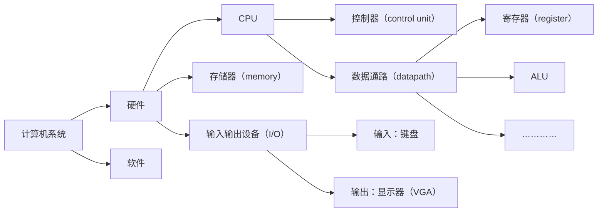
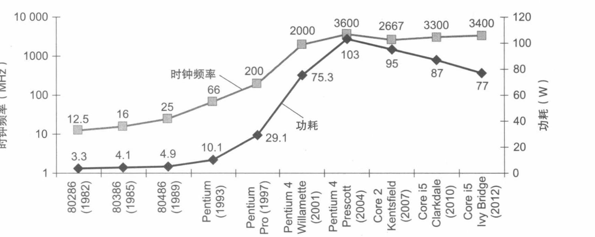
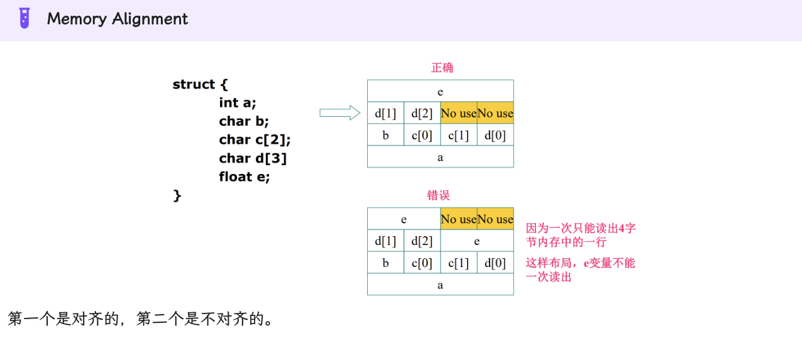
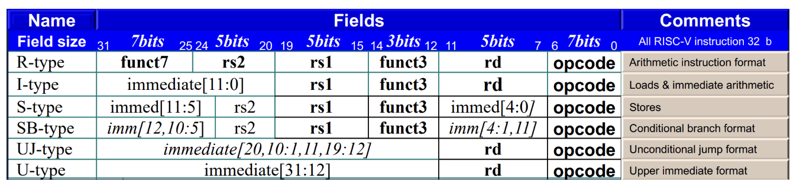

# 计算机组成笔记
- [计算机组成原理](docs/ZJU_CS/计算机组成原理.md)
于复习时记录的笔记，主要是为了方便查阅，不保证内容的准确性，如有错误请指正。

## 基础概念

1. 图示理解计算机系统

2. 八个伟大思想
> 面向摩尔定律的设计：摩尔定律是指集成电路上可容纳的晶体管数目每隔18-24个月便会增加一倍，而价格不变。

> 抽象：计算机系统中的每一层都是在上一层的基础上构建的，每一层都是对下一层的抽象。

> 加速经常性事件：对于经常发生的事件，可以通过专门的硬件来加速。

> 并行性：通过并行处理来提高性能。（parallelism）

> 可靠性：通过冗余来提高可靠性（reliability by redundancy）。

> 流水线：将一个任务分解为多个子任务，然后并行处理。

> 存储器层次结构：通过多级存储器来提高性能。
（

> 通过预测提高性能：在某些情况下，假设预测错误的代价很小，可以通过预测来提高性能。

3. 性能指标
响应时间（response time）：从请求发出到收到响应的时间。（执行时间）
吞吐量（throughput）：单位时间内完成的任务数。
带宽（bandwidth）：单位时间内传输的数据量。

$性能X = 1 / 响应时间Y$

具体概念：
CPU执行时间（CPU time）：CPU执行指令的时间。
分为用户和系统时间，用户时间是CPU执行用户程序的时间，系统时间是CPU执行内核程序的时间。
CPU性能（CPU performance）：CPU执行时间的倒数。
时钟周期数（clock cycles）：CPU执行时间乘以时钟频率。
时钟频率（clock rate）：时钟周期的倒数。
$CPU time = CPU clock cycles * Clock cycle time = CPU clock cycles / Clock rate
$

程序的指令数（Instruction count）：程序中的指令数。
CPI（cycles per instruction）：每条指令的平均时钟周期数。
$CPU time = Instruction count * CPI * Clock cycle time$

4. 功耗墙
功率已经接近极限，难以冷却，无法在商用处理器上继续提高时钟频率，因此需要通过并行处理来提高性能。

工耗 = 电容 * 电压平方 * 开关频率（时钟频率）

5. 多处理器
多核处理器：在一个芯片上集成多个处理器核心。
6. Mips
MIPS（百万指令每秒）：每秒执行的指令数。
MIPS = 指令数 / （执行时间 * 10^6）= 10^6 / CPI / Clock cycle time

## 指令
### 部分规定
32-bit data is called a word. 64-bit is called a doubleword.
risc-v有32个通用寄存器，编号为x0-x31，x0总是为0，x1是程序计数器（PC）。
每个寄存器都是64位的。
Risv-v为小端序，即低位字节存储在低地址处。（little-endian）
Words-aligned：数据的地址是4的倍数，地址以byte为单位。

### 指令格式
R-type：操作码（opcode）+ 目的寄存器（rd）+ 源寄存器1（rs1）+ 源寄存器2（rs2）+ 功能码（funct3）+ 扩展功能码（funct7）// 用于乘法和除法
I-type：操作码（opcode）+ 目的寄存器（rd）+ 源寄存器（rs1）+ 立即数（imm）// 用于立即数运算
S-type：操作码（opcode）+ 立即数（imm[11:5]) + 源寄存器（rs1）+ 源寄存器（rs2）+ 功能码（funct3）+ 立即数（imm[4:0])// 用于存储
B-type：操作码（opcode）+ 立即数（imm[12]) + 立即数（imm[10:5]) + 源寄存器（rs1）+ 源寄存器（rs2）+ 功能码（funct3）+ 立即数（imm[4:1]) + 立即数（imm[11])// 用于分支
U-type：操作码（opcode）+ 目的寄存器（rd）+ 立即数（imm）// 用于加载
J-type：操作码（opcode）+ 目的寄存器（rd）+ 立即数（imm[20]) + 立即数（imm[10:1]) + 立即数（imm[11]) + 立即数（imm[19:12])// 用于跳转

